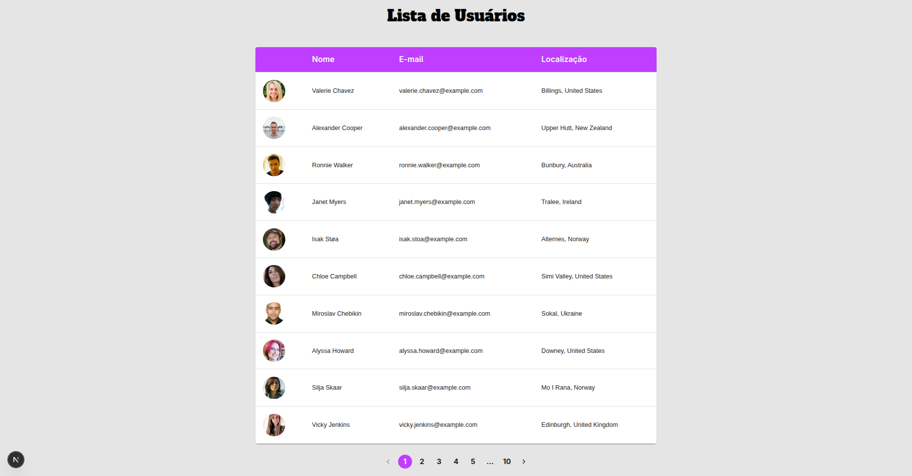

# 🟣 User Dashboard – Consumo de API Next.js + Tailwind + MUI

<h3 align="center">📸Screenshot</h3>
<p>
<h1 align="center"></h1>
<h1 align="center"></h1>
<h1 align="center"></h1>

## `Sobre`
Um projeto desenvolvido como parte de um teste técnico, reunindo React/Next.js, TailwindCSS, Material UI, e consumo da API pública RandomUser.me.

A aplicação exibe uma tabela paginada de usuários, com foto, nome, e-mail e localização, além de um layout moderno, responsivo e totalmente estilizado com Tailwind + MUI Theme Customization.

## `🚀 Funcionalidades`

✔️ Listagem de usuários em tabela <br>
✔️ Paginação funcional <br>
✔️ Hover nas linhas da tabela <br>
✔️ Estilização combinando Tailwind + Material UI <br>
✔️ Fonte customizada (Google Fonts) <br>
✔️ Tema próprio com cor personalizada purpleTheme <br>
✔️ Layout totalmente responsivo <br>
✔️ Fetch de usuários usando API pública randomuser.me <br>

## `🔗 Rotas principais`
- http://localhost:3000/login
- http://localhost:3000/register
- http://localhost:3000/users

## `🛠️ Tecnologias Utilizadas`

Frontend

- Next.js 16
- React 18
- Typescript
- TailwindCSS
- Material UI (MUI)
- Next/Image
- Google Fonts (Caveat, Poppins)

API

- https://randomuser.me/api/

## `📦 Instalação e Uso`
Clone o repositório:
```bash
git clone git@github.com:AAndersonSantos/Nextjs-Test-System.git
```
Instale as dependências:
```bash
npm install
```
Execute o projeto em modo de desenvolvimento:
```bash
npm run dev
```
Abra no navegador:
```bash
http://localhost:3000
```
## `🧑‍💻 Autor`
Anderson Santos
Desenvolvedor Full Stack